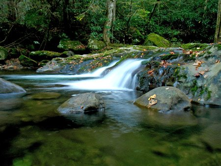

+++
title = 'Earth Day 2008'
date = 2008-04-22
description = 'A celebration of Earth Day in 2008'
+++

Today is Earth Day. To celebrate, today I'm going to post a short list of some great links in the spirit of the holiday that are relevant to the Millennial. My favorite is the solar-powered iPod, but check them all out!

[Reegle](http://www.reegle.info/) - A renewable energy search engine that tries to bill itself as Web 2.0. Technologically speaking, it's not particularly advanced - no social media, the web design itself is a little off in places, and it appears to be trying to model itself after Google but doesn't come close. However, as a resource for renewable energy information and news related to that topic, it does a good job. There IS a blog, too, and though it clearly needs an editor, the content is in the right place and well-informed.

[EcoWorld](http://www.ecoworld.com/) - This site has a wealth of content. Don't let the ugly design put you off - everything is fairly well organized, and there's a few fun things in there, like this biofuel land calculator. I'm no scientist though, so take this - as with all things - with a grain of salt.

[Solar-powered iPod charger](http://www.ipodjuice.com/solar-powered-ipod-battery-charger.htm) - With this and an iPod Touch or iPhone, you can take your mobile computing into the bush and not worry about powering the thing. Also, because it's solar power, it's greener than the alternative.

[GreenTechnoLog](http://www.greentechnolog.com/) - One of the better green tech blogs I've found. Multiple good articles with great information! Dumb Little Man has [an excellent post on reducing your carbon footprint](http://www.dumblittleman.com/2008/02/turn-green-heres-15-ways-reduce-your.html). I can't recommend this blog enough, and it turns out he had a perfect post for this topic!

[GreatGreenGadgets](http://greatgreengadgets.com/gadgets/2007/12/17/carnival-of-the-green-108th-edition/) has a blog post about…well, a whole lot of green gadgets, tricks, and websites. Lots. Check it out!
