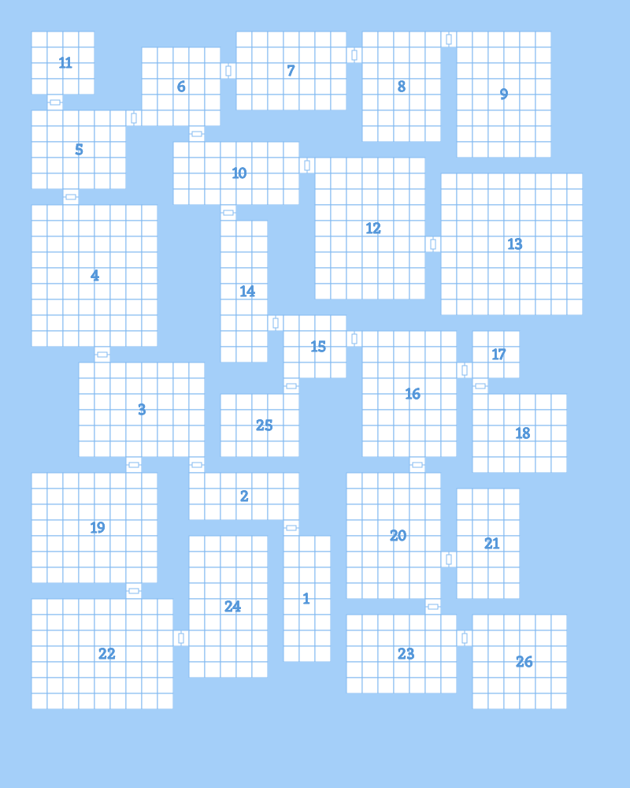

+++
title = 'Iron Arachne Dungeon Generator and future plans'
date = 2022-06-07
description = 'Launch of the new Dungeon Generator for Iron Arachne and plans for future development'
+++

This weekend past, I launched the dungeon generator for Iron Arachne. I've been working on it off and on
for a few weeks and I finally got it to the point where it was usable and useful. However, it's by no means
complete, and a lot of features were left unfinished.

The above is an example of the maps it currently generates. In terms of pathing, there is a pretty linear
flow to the dungeon layout - a higher-number room is deeper into the dungeon. This makes it easy to determine
where to put goals like boss encounters. However, it also means the dungeon doesn't encourage exploration
or reward players who enjoy that activity, and really it gets a little boring.

So, one of the first changes is going to be the addition of more loops throughout the layout. This will
result in more connections between rooms. Corridors will need to be addressed. Right now, there's no
logic for creating even straight corridors between rooms. Angled corridors will require more effort.

Another early change will be the addition of non-rectangular rooms. This can include organic-looking
caverns, but also different regular rooms, like circular chambers.

I plan on adding something else to the terrain, too - "lakes." In this case, lakes can refer to bodies
of water, but also pools of lava and bottomless chasms. These will have be carefully generated so that
they add character without cutting off sections of the dungeon.

## Creatures and Characters

Mobs are divided into two types - creatures and characters. Anything that thinks requires creating two
resources in the system - a set of naming rules, and a species. Non-sentient things are classified
as creatures, and only require the addition of a single resource. The trouble is that most encounters
are comprised of characters. For the initial release of the dungeon generator, I added orcs, goblins,
and trolls. As far as the underlying system goes, they're equal to PC races like humans and elves.
I intend to keep it that way - they're not "monsters," they're just a different kind of thinking being.
This makes any added species useful in a wide variety of ways. They're not just for dungeon encounters.
They can be used in any system that uses characters.

I plan on adding all of the common "monster" species in the near future. This includes, but is not limited to,
the following:

-   Bugbears
-   Centaurs
-   Dark elves
-   Deep dwarves (duergar)
-   Deep gnomes
-   Dragons (this one's difficult)
-   Dryads
-   Fairies
-   Firbolgs
-   Gnolls
-   Gorgons
-   Half-celestials (aasimar)
-   Half-elementals (genasi)
-   Hobgoblins
-   Kobolds
-   Lizardfolk
-   Mind flayers
-   Minotaurs
-   Nymphs
-   Ogres
-   Pixies
-   Satyrs
-   Sea elves
-   Serpentfolk (based on Yuan-ti)
-   Troglodytes

In addition, there are currently a few "templates" that can be applied to both creatures and characters.
Right now the list only consists of zombies, vampires, and skeletons. However, I plan on adding the following:

-   Ghost
-   Lich
-   Werebear
-   Weretiger
-   Werewolf

Also, the list of creatures is going to expand too. Eventually there will be a great many monsters from
a great many sources.

## Locks, Keys, and Treasure

At the moment, keys are only used for doors. I plan on making keys operate only on locks, and locks be
present in doors, chests, and other things. Like the existing keys, they will be populated in places
that don't make them unobtainable.

Treasure is limited to coins only at the moment. The system that generates treasure needs a rewrite in
order to support mixed treasure piles. This won't be too difficult to implement. I already have gemstone
support written, even though it's not used yet. Art objects will be fairly straightforward. Magic items,
on the other hand, are going to be more difficult to implement. I plan on leaning on the existing magic
weapon generator for this. I also will need to build other types of magic item generators.

All of these, incidentally, will be as system-neutral as possible. Like the dungeon generator itself though,
they'll be heavily informed by old school systems.

## Closing thoughts and other things

There is a lot of work that could be done that other generators have not yet. I won't promise anything
beyond what I've outlined above, but there are some interesting ideas that I want to explore. I'm
borrowing from the dungeon generation and population algorithms of roguelikes for some of this. After I
finish my entry for [/r/rpg_generators' June 2022 challenge](https://www.reddit.com/r/rpg_generators/comments/v2mdaa/june_2022_generators_challenge_space/), I'll come back to the dungeon generator
and iterate more. Thanks for reading.
