+++
title = "The New HeroQuest"
date = 2021-11-09
+++

So today I received the new HeroQuest in the mail. Last year,
I backed the Hasbro-run crowdfunding campaign to remake it. I
backed at the highest level, the "Mythic" tier, which came with
quite a few extra goodies.

I plan on writing a second blog post after I play it a few times.

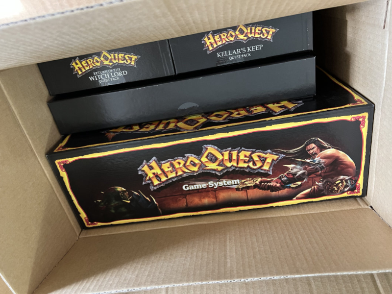

_Opening up the shipping box!_

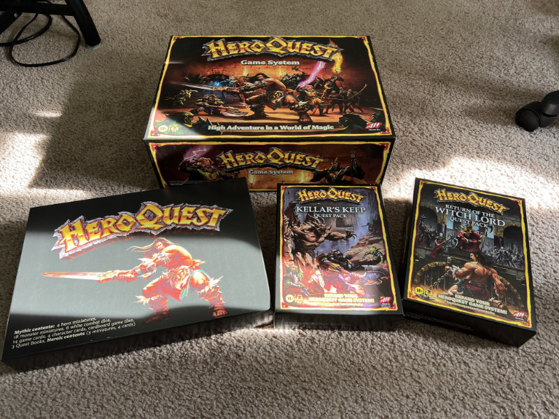

_The contents of the shipping box._

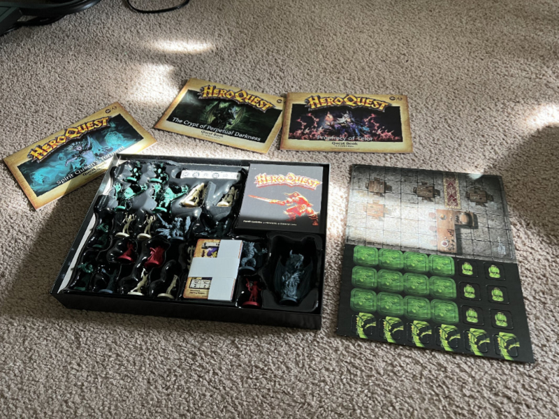

_This is what came in the Mythic-exclusive box._

What follows is a series of photos comparing my copy of the
original game released in the late 80s to the new one.

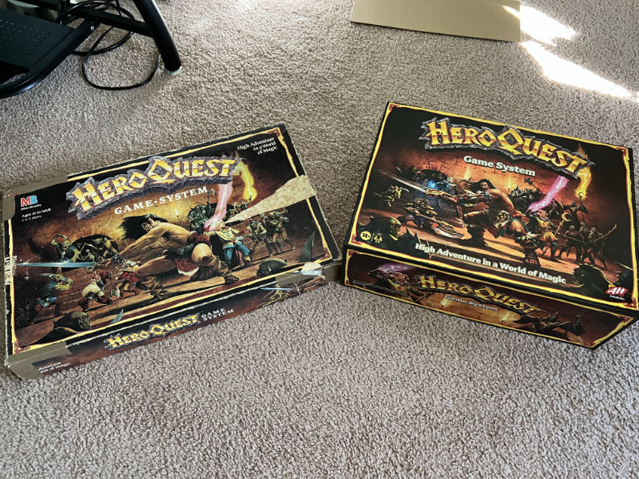

The original box is shorter and wider. The artwork on the new
one is a nice tribute to the original.

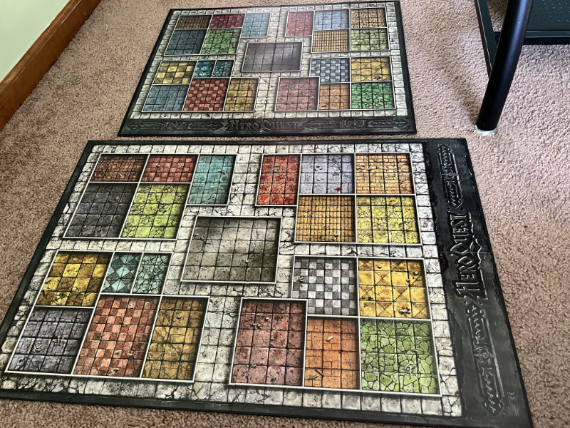

The board in the new one is a bigger scale but otherwise follows
the layout of the original.

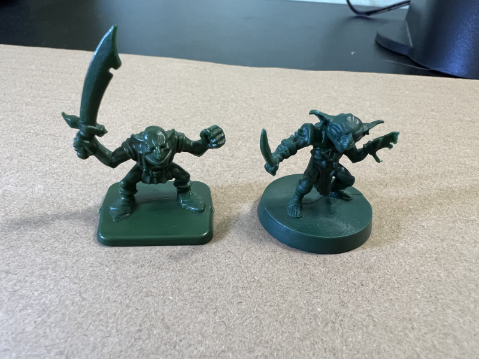

On the left is a goblin from the original, and on the right is
the new one. The originals were made of a hard plastic; the new
ones are a softer plastic. I'm not sure if they'll hold paint
well yet.

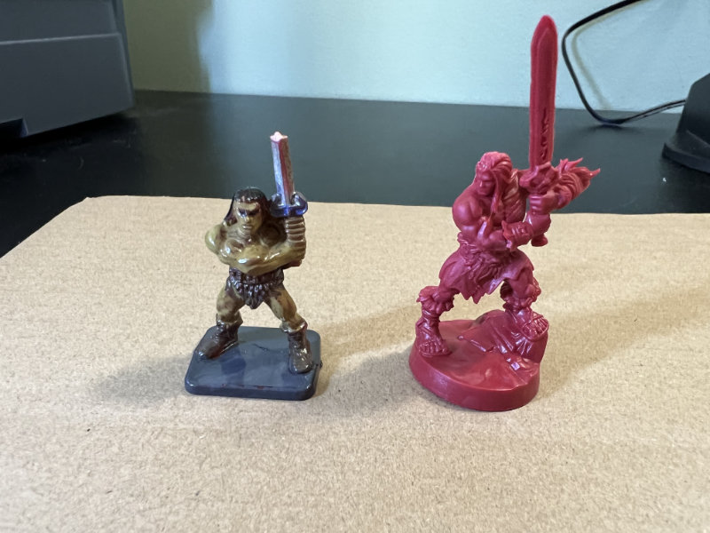

On the left is the barbarian that I painted when I was a teenager,
with the sword partially broken. On the right is the new barbarian.
Not shown here is the female barbarian that came in the Mythic box.

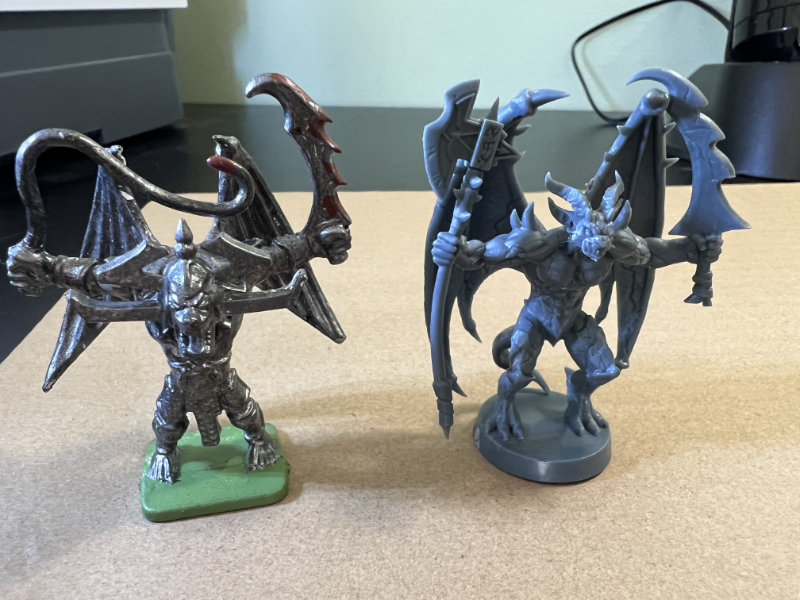

The gargoyle in the new one is slightly bigger and has an axe instead
of a whip. Otherwise it's pretty close to the original.

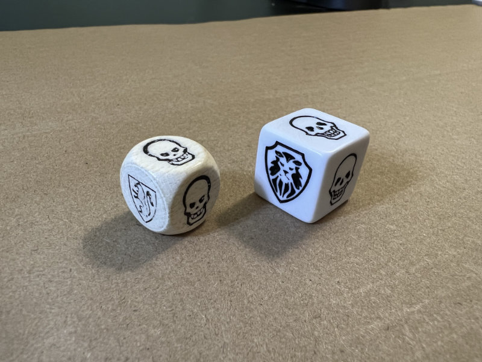

The new dice are bigger and less round. The shield is a different
symbol, too. I think these will be easier to roll, honestly.

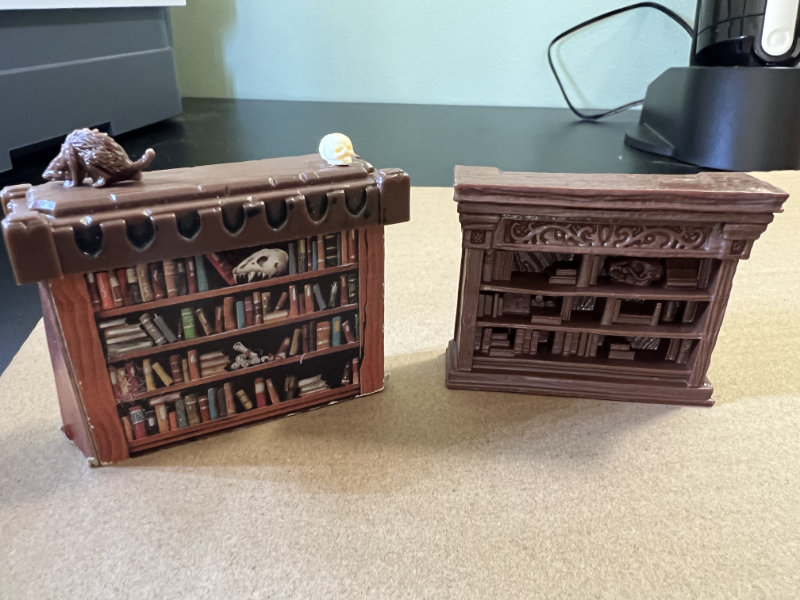

All of the furniture in the new game is full plastic 3D models. The
furniture in the original was cardboard with some plastic parts. Not
shown here are the rats and skulls that come in the new set.

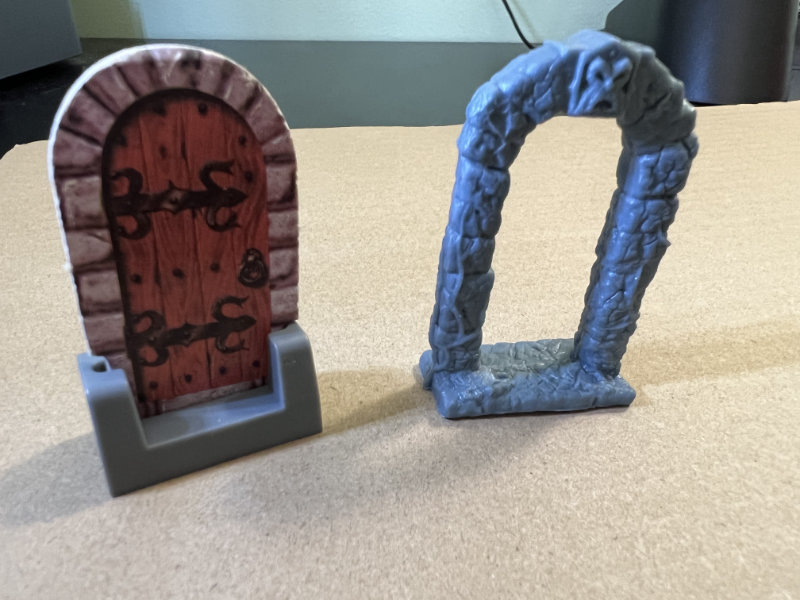

I like the new doors better, though one or two of the ones in my box
are slightly warped.

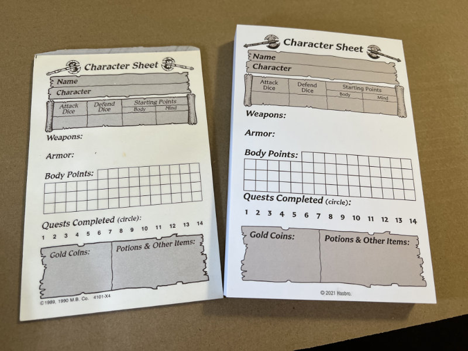

The new character sheets are almost identical to the original, but
there are a LOT more of them. This is a thick set.

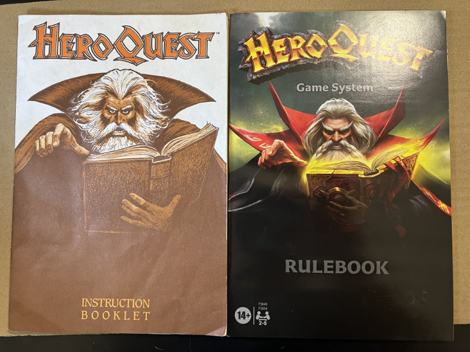

The rulebook in the new version is full color on glossy paper. The
artwork is much improved. I haven't dug through the rules to see if
the layout is changed, though.

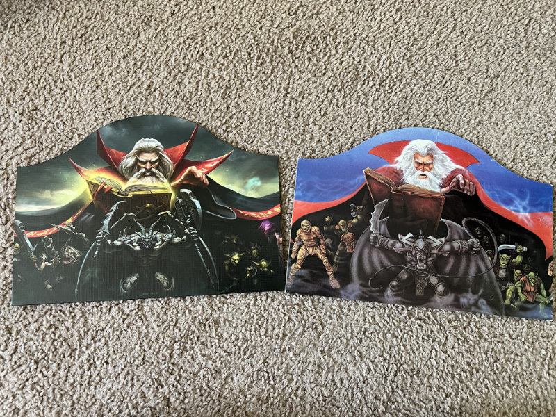

The Zargon player's screen is the same size as the original, but it
has new artwork.

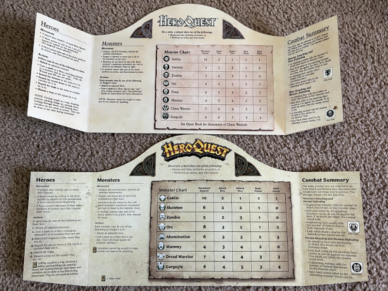

The reverse of the Zargon player's screen has mostly the same information,
although the names of some of the monsters are different and the text
is laid out better.

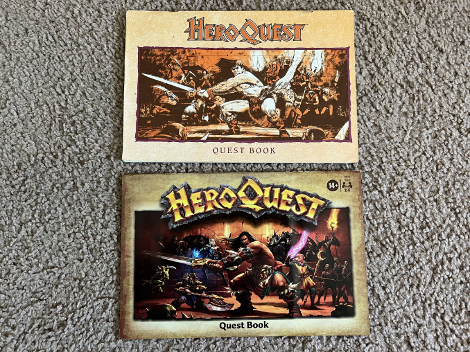

The new quest book is also full color glossy. Again, I haven't flipped
through it yet.

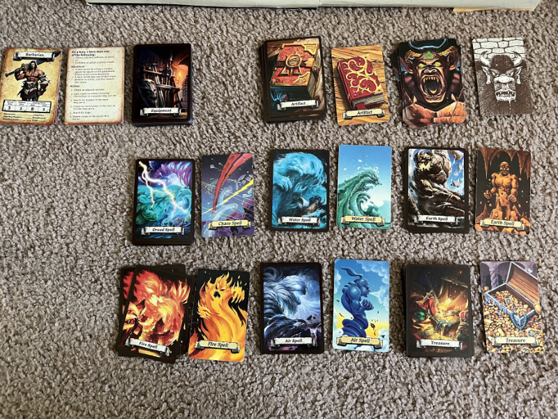

Each of the original cards is present in the new version, but with new
artwork. Also, Chaos Magic has been renamed Dread Magic, and there are
new equipment cards, player rule reference cards, and character cards.
