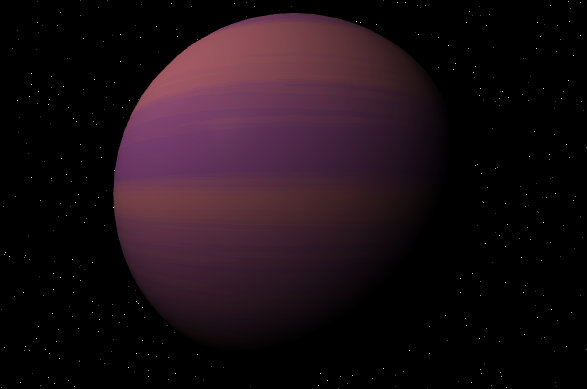
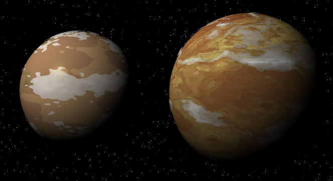
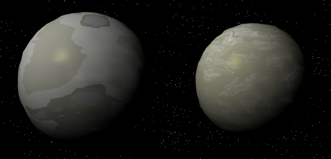
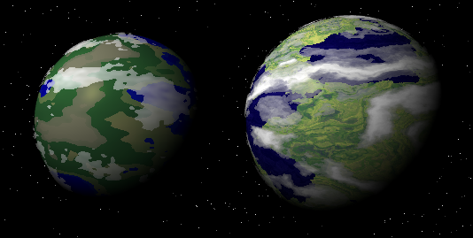
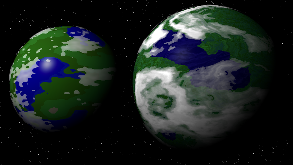
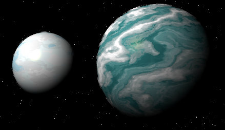
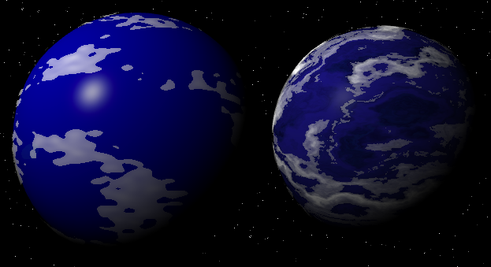
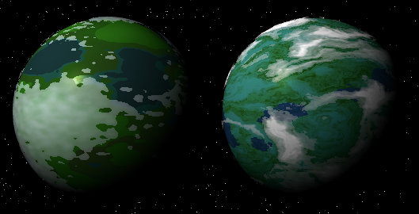
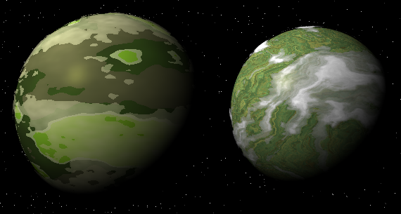
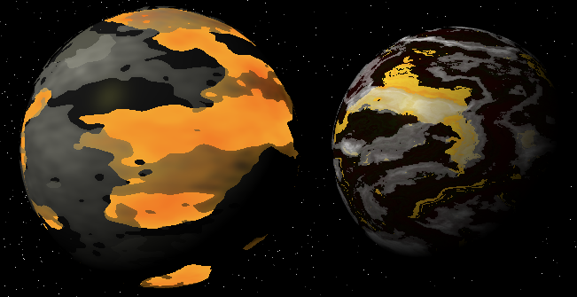

+++
title = "Upgrading the Iron Arachne planet generator"
date = 2022-04-22
description = "Describing some big changes that the planet generator underwent"
+++

Today I upgraded the graphics for the [planet generator on Iron Arachne](https://ironarachne.com/#/planet).

It was not a small task, as I taught myself how to do domain warping and rewrote most of the GLSL shaders
that are used to create these graphics.

But first, the only one that did NOT get changed, because I like it as is:

I might end up tweaking the gas giant a bit, but not today.

The arid planet is a little more colorful, but still looks bleak. The new cloud shader is
a huge improvement.

It's less obvious in this particular shot, but the barren planet gained a lot more detail
in its surface texture. I still don't care for how I did the vertex displacement, but eh, that can
wait for another day.

The garden world was the hardest. I'm still not happy with it, but it's better than it was.

The jungle world looks much better. It definitely has more of a forested feel.

The ice world is much more colorful than it used to be. Originally I was going to go for
a color scheme similar to the original, but I liked this version too much and kept it.

The ocean world now feels a lot less plastic and has more detail to it. The new clouds help.

The new swamp world looks just as unfriendly as the original, but perhaps more colorful now.
I might tone down the brighter hues in the future.

The toxic world is less cartoony now. It no longer has the neon green oceans and generally
looks like an awful place to visit.

The new volcanic world is much more volcano-y. Instead of just oceans of lava, there are
now rivers too, and the glow is less pronounced.

All in all, I think it's a pretty impressive upgrade, though there's still a lot of work
to be done. At some point I really want to figure out atmospheric scattering.
