+++
title = "Upgrading the star and planet generators on Iron Arachne"
date = 2023-12-21
description = "I recently updated the star and planet generators for Iron Arachne with brand-new shader graphics."
+++

For over a month I've been working on upgrading the graphics that I generate for stars and planets
in the planet, star nation, and star system generators on [Iron Arachne](https://ironarachne.com).

That work is now done and live.

Instead of setting up a 3D scene, texturing a sphere, and adding cloud layers if appropriate, now
I'm doing everything in a single 2D shader. This was a _lot_ of math to learn and apply.

The new shaders have cool additions like atmospheric scattering and much better planetary geographics.

Here's a comparison of the old version and new version for each of the planet types.

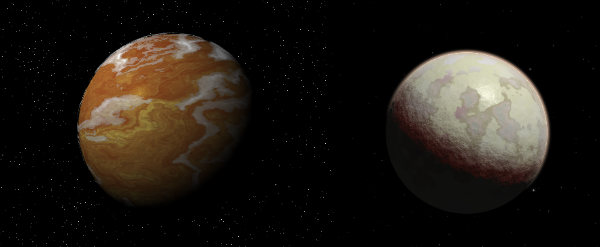

The "arid" planet. Meant to be like a Mars or Arrakis world. The new version has a very thin atmosphere
that you can just barely see. Clouds are almost nonexistent most of the time.

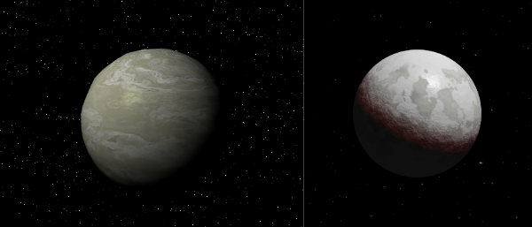

The "barren" planet. This is basically just a rock spinning in space. The old version
had a deformation of the sphere. The new version doesn't. This is the only one that has no atmosphere
in the new version.

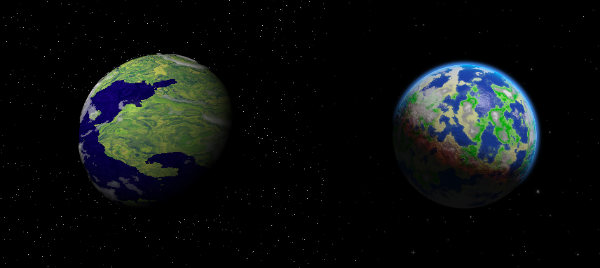

The "garden" planet. This one is meant to be Earth-like. The old version was honestly really
ugly.

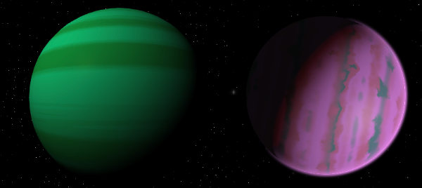

The "gas giant" planet. The new version has very slight atmospheric scattering, a much more vibrant
surface, and variable rotation.

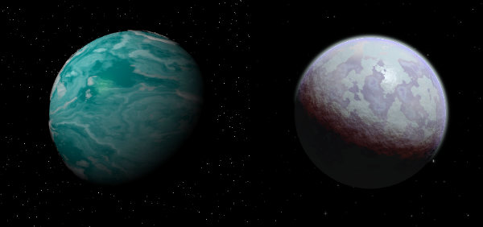

The "ice" planet. The old one was pretty ugly, though I think the new one could stand to have a bit more "blue"
in it. We'll see if I change that in a future pass.

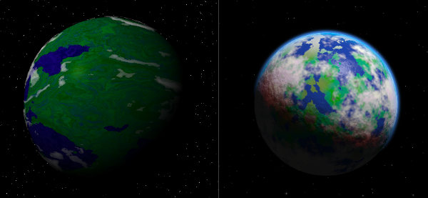

The "jungle" planet. This is something the Predator aliens would love. The new version has a better surface and
looks more like a planet.

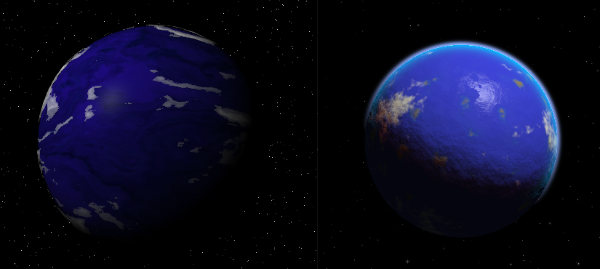

The "ocean" planet. Mon Calamari is a good example of one. The new version just looks better on all fronts. I
gave it some small amount of dry land, too.

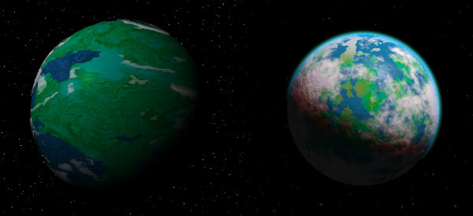

The "swamp" planet. You're probably familiar with Dagobah at least. The "oceans" now look shallower, among other
things.

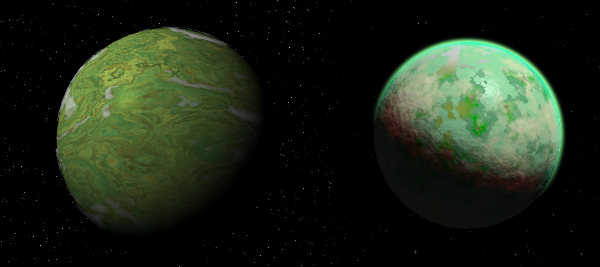

The "toxic" planet. This time around, I made it look truly icky, with a sickly green atmosphere.

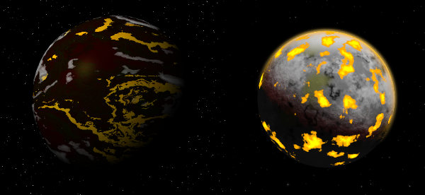

The "volcanic" planet. Mustafar is an example of one such. I am _really_ happy with how the new version turned
out. It looks much more visceral and lava-y.

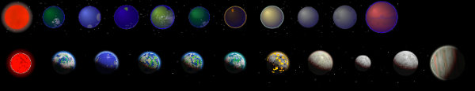

The above image is a comparison of the star nation system graphic done the old way (above) and the new way (below).
This really shows some of the other tweaks, like size variation and the new stars.
